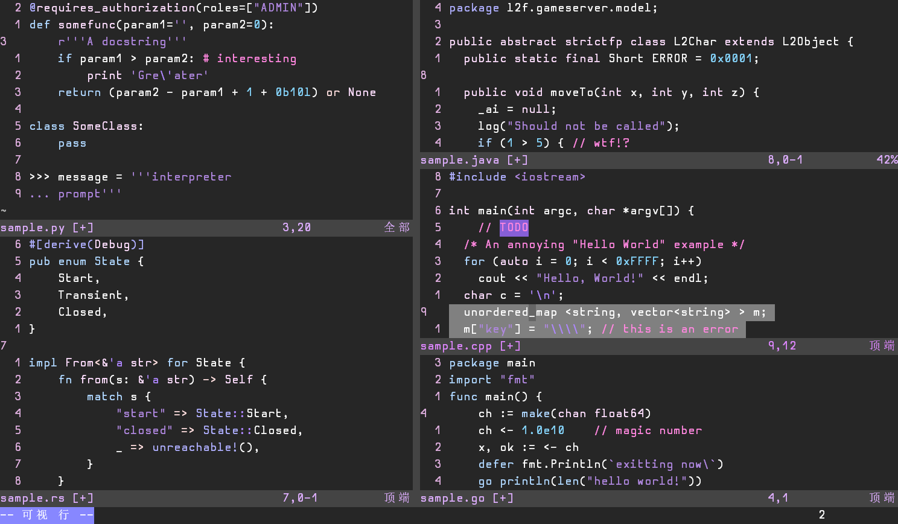
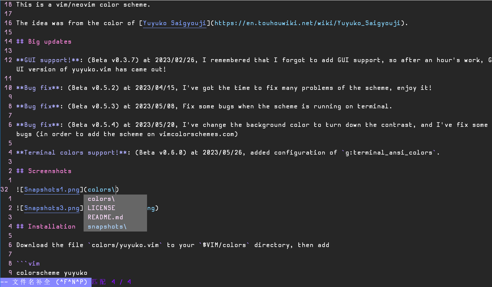

# Yuyuko.vim

```
__   __                 _              _           
\ \ / /   _ _   _ _   _| | _______   _(_)_ __ ___  
 \ V / | | | | | | | | | |/ / _ \ \ / / | '_ ` _ \ 
  | || |_| | |_| | |_| |   < (_) \ V /| | | | | | |
  |_| \__,_|\__, |\__,_|_|\_\___(_)_/ |_|_| |_| |_|
            |___/                                  
```

## Introduction

This is a vim/neovim color scheme.

The idea was from the color of [Yuyuko Saigyouji](https://en.touhouwiki.net/wiki/Yuyuko_Saigyouji).

## Big updates

**GUI support!**: (Beta v0.3.7) at 2023/02/26, I remembered that I forgot to add GUI support, so after an hour's work, GUI version of yuyuko.vim has came out!

**Bug fix**: (Beta v0.5.2) at 2023/04/15, I've got the time to fix many problems of the scheme, enjoy it!

**Bug fix**: (Beta v0.5.3) at 2023/05/08, Fix some bugs when the scheme is running on terminal.

**Bug fix**: (Beta v0.5.4) at 2023/05/20, I've change the background color to turn down the contrast, and I've fix some bugs (in order to add the scheme on vimcolorschemes.com)

**Terminal colors support!**: (Beta v0.6.0) at 2023/05/26, added configuration of `g:terminal_ansi_colors`.

## Screenshots





## Installation

Download the file `colors/yuyuko.vim` to your `$VIM/colors` directory, then add 

```vim
colorscheme yuyuko
```

in your `.vimrc` or `_vimrc` file.

**Attention**: if you are running vim without support of 256 colors, this color scheme may not work.

## Vscode version

[View on github](https://github.com/hylwxqwq/yuyuko-vim-vsc)

[View on Marketplace](https://marketplace.visualstudio.com/items?itemName=hylwxqwq.yuyuko-vim-vsc)
