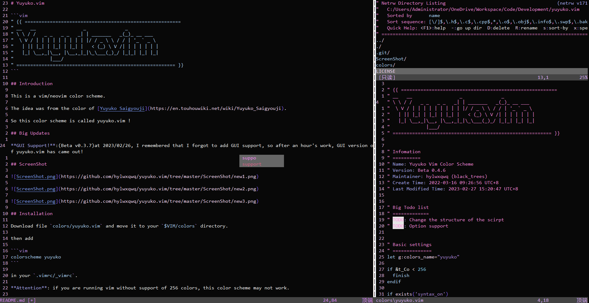
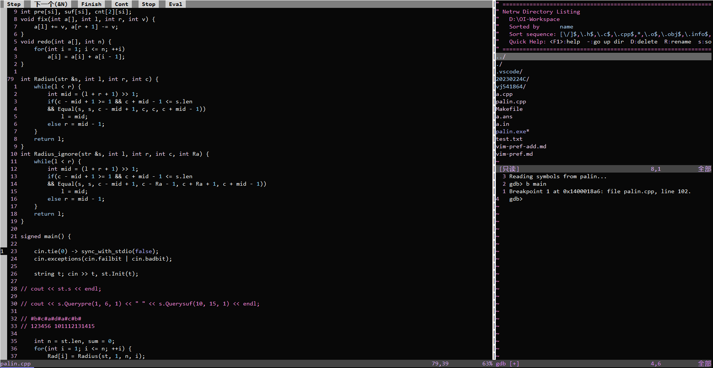
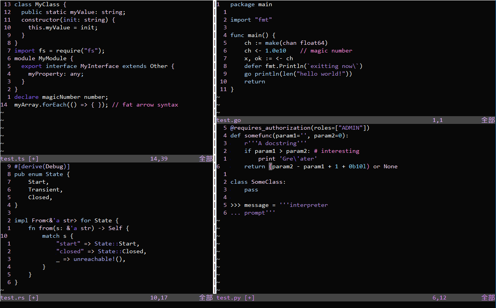

# Yuyuko.vim

```vim
" {{ ========================================================
" __   __                 _              _           
" \ \ / /   _ _   _ _   _| | _______   _(_)_ __ ___  
"  \ V / | | | | | | | | | |/ / _ \ \ / / | '_ ` _ \ 
"   | || |_| | |_| | |_| |   < (_) \ V /| | | | | | |
"   |_| \__,_|\__, |\__,_|_|\_\___(_)_/ |_|_| |_| |_|
"             |___/                                  
" ========================================================= }} 
```

## Introduction

This is a vim/neovim color scheme.

The idea was from the color of [Yuyuko Saigyouji](https://en.touhouwiki.net/wiki/Yuyuko_Saigyouji).

So this color scheme is called yuyuko.vim !

## Big Updates

**GUI Support!**: (Beta v0.3.7) at 2023/02/26, I remembered that I forgot to add GUI support, so after an hour's work, GUI version of yuyuko.vim has came out!

**Big Fix**: (Beta v0.5.2) at 2023/04/15, I've got the time to fix many problems of the scheme, enjoy it!

## ScreenShot







## Installation

Download file `colors/yuyuko.vim` and move it to your `$VIM/colors` directory.

then add 

```vim
colorscheme yuyuko
```

in your `.vimrc/_vimrc`.

**Attention**: if you are running vim without support of 256 colors, this color scheme may not work.

## TodoList

- [x] GUI support.
- [x] Add used color list.
- [ ] Change the structure of the color shceme.
- [x] Logo and slogan for this project.
- [x] More ScreenShots.
- [x] More support for js, json, java, ruby, sql, c#, css, xml, html, php, go.
- [x] Fix the unexpected syntax in .py file and .vim file.
- [x] Fix the unexpected syntax in .md file and .yml file.
- [x] Fix the unexpected syntax in all files.

## Vscode version

**!!Not maintaining!!**

[View on github](https://github.com/hylwxqwq/yuyuko-vim-vsc)

[View on Marketplace](https://marketplace.visualstudio.com/items?itemName=hylwxqwq.yuyuko-vim-vsc)
